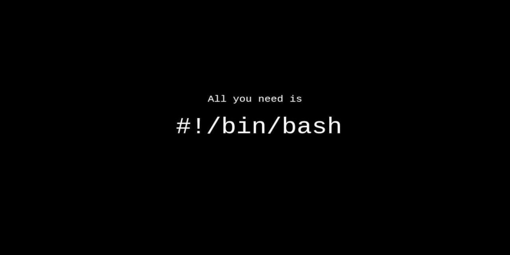

# Hands on Bash **\>**  
  

This repository covers a almost all the basics of bash shell scripting, startig from scratch!  

## Topics Covered
The complete repository is arranged in following 22 major topics. These topics are given below:  

1. [Hello Bash Scripting](https://github.com/ravi-prakash1907/Hands-on-Bash/blob/main/scripts/helloScript.sh)  
2. [Redirect to file](https://github.com/ravi-prakash1907/Hands-on-Bash/blob/main/scripts/redFile.sh)  
3. [Comments+](https://github.com/ravi-prakash1907/Hands-on-Bash/blob/main/scripts/commentsPlus)  
 	> single line  
 	> multi line  
 	> heredoc  

4. [Conditional Statements](https://github.com/ravi-prakash1907/Hands-on-Bash/blob/main/scripts/conditionals/)  
 	> if-elif-else  
 	> case  
 	> operators  

5. [Loops](https://github.com/ravi-prakash1907/Hands-on-Bash/blob/main/scripts/loops/)  
 	> while  
 	> until  
 	> for  
 	> break  
 	> continue  

6. [Script I/P](https://github.com/ravi-prakash1907/Hands-on-Bash/blob/main/scripts/scriptInputs)  
 	> $1, $2.., $#, $0, $@  
 	> stdin (standered input)  

7. [Script O/P](https://github.com/ravi-prakash1907/Hands-on-Bash/blob/main/scripts/scriptOutputs/)  
 	> stdout, stderr  
 	> 1> 2>  
 	> shortcuts: >, 1>&2, >&  

8. [Pipes & Export b/w Scripts](https://github.com/ravi-prakash1907/Hands-on-Bash/blob/main/scripts/pipes.sh)  
 	> ./export  

9. [String Ops](https://github.com/ravi-prakash1907/Hands-on-Bash/blob/main/scripts/str.sh)  
 	> {var^}  
 	> {var^l}  
 	> {var^^}  

10. [Numbers and Arithmetic](https://github.com/ravi-prakash1907/Hands-on-Bash/blob/main/scripts/numsPlus/)  
 	> (( ))  
 	> bc calculator  
 	> obase / ibase  

11. [declare Command](https://github.com/ravi-prakash1907/Hands-on-Bash/blob/main/scripts/declare.sh)   
 	> restrict var. behaviour  
 	> var. type can't be restricted  
 	> eg -r (read only) var declearation  

12. [Arrays](https://github.com/ravi-prakash1907/Hands-on-Bash/blob/main/scripts/array.sh)  
 	> all elements - arr\[@\]  
 	> index -  !arr\[@\]  
 	> count/len - #arr\[@\]  
 	> delete - 'unset arr\[index\]'  
 	> add - arr\[ANY index\]=val  

13. [Functions](https://github.com/ravi-prakash1907/Hands-on-Bash/blob/main/scripts/functions/)  
 	> 'local' var  
 	> passing param - funName arg1 arg2 ..  
 	> returning  

14. [Files and Dir](https://github.com/ravi-prakash1907/Hands-on-Bash/blob/main/scripts/files/)  
 	> mkdir, touch, >, >>  
 	> -r, -w, -x, -d, -e, -f  

15. [Sending Emails](https://github.com/ravi-prakash1907/Hands-on-Bash/blob/main/scripts/email.sh)  
 	> install smtp  
 	> ssmtp.config  
 	> mail structure  

16. [Curl in Script](https://github.com/ravi-prakash1907/Hands-on-Bash/blob/main/scripts/curling.sh)  
 	> -O - keep web name  
 	> -o \<file name\>, \> \<file name\>  
 	> flag '-I' - header of file  

17. [Professional Menu](https://github.com/ravi-prakash1907/Hands-on-Bash/blob/main/scripts/profMenu/)  
 	> select loop  
 	> waiting (-t \<sec\>)  

18. [Filesystem Events](https://github.com/ravi-prakash1907/Hands-on-Bash/blob/main/scripts/inotify/)  
 	> Waiting with 'inotify'  
 	> using inotifywait  
 	> flag -m  

19. [Intro to grep](https://github.com/ravi-prakash1907/Hands-on-Bash/blob/main/scripts/grep.sh)  
 	> count -c  
 	> case-ignore -i  
 	> line-num -l  
 	> except-match -v  

20. [Intro to awk](https://github.com/ravi-prakash1907/Hands-on-Bash/blob/main/scripts/awk.sh)  
 	> using {print}  
 	> selecting nth ({print $n}) field from line  
 	> picking multiple fields ({print $1,$4,$7})  
 	> searching in line --> /searchKey/  

21. [Intro to sed](https://github.com/ravi-prakash1907/Hands-on-Bash/blob/main/scripts/sed.sh)  
 	> sed --> screen-editor  
 	> substituting 's/-/-/'  
 	> applying globally - 'g'  
 	> manipulating file (-i)  

22. [Debugging Bash Scripts](https://github.com/ravi-prakash1907/Hands-on-Bash/blob/main/scripts/debugging/)  
 	> while execution cmd (bash -x)  
 	> decleared in script (#!\<path-bash\> -x)  
 	> Specific part (set -x ...\<to be debugged\>... set +x)  

---  

_* Codes can be accessed by visiting through the link provided with the topic titles._  

